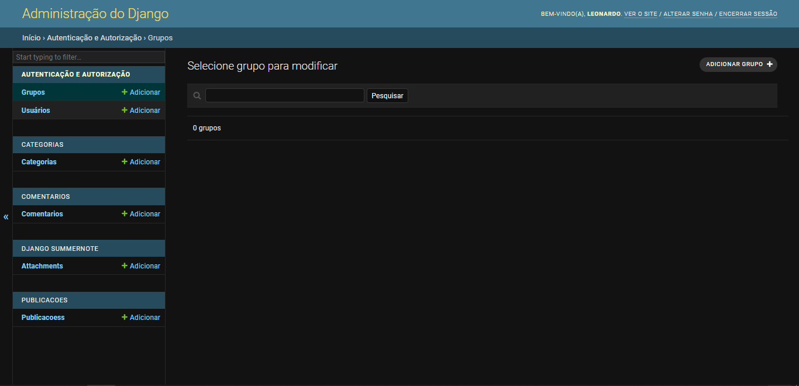

# **Blog**


Olá a todos, este repostório é resultado de estudos em python e um de seus frameworks para desenvolvimento web, o django. Este projeto foi desenvolvido em conjunto com o curso [Curso de Python 3 do Básico Ao Avançado](https://www.udemy.com/course/python-3-do-zero-ao-avancado/) na plataforma Udemy. 
Abaixo veremos um pouco do que é esse projeto e algumas dicas de como baixar e instalar o que é preciso para rodar ele na sua máquina.

- [**Blog**](#blog)
  - [**Técnologias Usadas Neste Projeto**](#técnologias-usadas-neste-projeto)
  - [**Baixando e Rodando Este Projeto**](#baixando-e-rodando-este-projeto)
    - [**Clonando este repositório**](#clonando-este-repositório)
    - [**Instalando um Ambiente Virtual**](#instalando-um-ambiente-virtual)
    - [**Instalando as Dependências do projeto**](#instalando-as-dependências-do-projeto)
    - [**Fazendo as migrações**](#fazendo-as-migrações)
    - [**Criando um Super Usuário para o site**](#criando-um-super-usuário-para-o-site)
    - [**Rodando a aplicação**](#rodando-a-aplicação)
  - [**Primeiros Passos**](#primeiros-passos)
    - [**Estrutura do Projeto**](#estrutura-do-projeto)
    - [**Primeiras Impressões**](#primeiras-impressões)
      - [**Página Inicial**](#página-inicial)

## **Técnologias Usadas Neste Projeto** 

Abaixo eu procurei mostrar as principais tecnologias que foram usadas para produzir este projeto.

* Django 4.0.6
* Python 3.9
* HTML5
* CSS3
* Bootstrap 5
* Sqlite 3

Lembrando que no arquivo [requirements.txt](./requirements.txt) estão informações mais detalhadas de outras tecnologias e bibliotecas utilizadas no projeto.

## **Baixando e Rodando Este Projeto**

Bem, o primeiro passo para executar este projeto é fazer um clone dele na sua máquina. Certifique-se de ter o Git instaldo na sua máquina, porque precisaremos dele no primeiro passo.

### **Clonando este repositório**

Para clonar este repositório abra seu terminal git e execute o comando abaixo:

```
    git clone https://github.com/leonhardc/blog-django.git
```

Espera terminar o clone do repositório e então entre no diretório do projeto. Mais a frente irei explicar um pouco mais sobre a estrutura de diretórios deste projeto. 

### **Instalando um Ambiente Virtual**

Recomendo o uso de um ambiente virtual para testar este código. Principalmente para não poluir seu python com muitos pacotes que podem ser descartados posteriormente e podem deixá-lo mais lento em outros projetos.

Para criar um ambiente virtual em python basta executar o comando na forma `python -m venv <nome do ambiente virtual>`. Neste projeto, nosso ambiente se chamará `venv`. Sendo assim, basta executar o comando abaixo:

```
    python -m venv venv
```

Depois de instalado, temos que ativar nosso ambiente virtual. No Windows podemos digitar o caminho `venv\Scripts\activate` no terminal para ativarmos nosso ambiente virtual. No linux podemos ativar o ambiente virtual com o comando `source venv/bin/activate`. 

Se ativado, seu terminal terá um prefixo `(venv)` logo no início da linha de comando.

### **Instalando as Dependências do projeto**

No diretório raiz do seu projeto `blog-django` terá um arquivo chamado [requirements.txt](./requirements.txt). Este arquivo contem todas as dependências necessárias para o projeto ser executado. Para instalá-las basta executar o comando:

```
    pip install -r requirements.txt
```

Lembrando que, recomenda-se que o comando acima seja executado com seu ambiente vietual criado e ativado.

### **Fazendo as migrações**

Toda vez que este projeto for clonado em uma máquina é necessário fazer as migrações para o banco de dados. Este processo é simples e só precisa de dois comandos, o primeiro configura as migragrações que serão feitas para o banco de dados e a segundo faz de fato as migrações para os bancos de dados. Para mais informações sobre o que são migrações e como elas funcionam veja a [documentação](https://docs.djangoproject.com/en/4.1/topics/migrations/).

Primeramente execute o comando abaixo para configurar suas migrações:

```
    python manage.py makemigrations
```

Logo em seguida, faça as migrações para o banco de dados:

```
    python manage.py migrate
```

Se forem feitas corretamente você poderá notar que irá aparecer um arquivo chamado `db.sqlite3` no diretório raiz do seu projeto. Este arquivo é o banco de dados da sua aplicação. 

### **Criando um Super Usuário para o site**

Podemos, com um só comando, criar um usuário administrativo para nosso site. Este usuário contem provilégios para lidar com quaisquer dados inseridos na nossa aplicação. Para fazermos isso temos que executar o comando abaixo:

```
    python manage.py createsuperuser
```

Logo após executar esse comando serão pedidas algumas informações como nome de usuário, email e senha do superusuário, preencha-as e siga adiante.

### **Rodando a aplicação**

Pois bem, será que já podemos rodar o nosso projeto? É claro que sim. Já configuramos o que era necessário.

Para executarmos este projeto iremos rodar um servidor local do próprio django.

```
    python manage.py runserver
```

Se tudo foi configurado da maneira correta você verá a seguinte mensagem no seu terminal:

```
    Watching for file changes with StatReloader
    Performing system checks...

    System check identified no issues (0 silenced).
    February 05, 2023 - 14:48:53
    Django version 4.0.6, using settings 'blog.settings'
    Starting development server at http://127.0.0.1:8000/
    Quit the server with CTRL-BREAK.
```
A partir deste momento você poderá acessar a aplicação digitadno o endereço `http://127.0.0.1:8000/` na barra de endereços do seu navegador.

## **Primeiros Passos**

### **Estrutura do Projeto**

A arvore de diretórios do nosso projeto é a seguinte:

```
    blog-django/
        blog/
        categorias/
        comentarios/
        media/
            post_img/...
        publicacoes/
            templates/
            templatetags/
        templates/
            parciais/
            static/
                vendor/
                    bootstrap/
                        css/
                        js/
                    jquery/
```

* **blog/**: Este é o diretório do app principal da nossa aplicação. Nele estão descritas as principais regras e configurações gerais da nossa aplicação. 
* **categorias/**: Este app implementa a ideia de categorias de publicações. 
* **comentarios/**: Neste app estão implementadas as regras para estrutura e armazenamento dos comentários que podem ficar em cada publicação.
* **media/**: Arquivos de media que normalmente ilustram uma publicação.
* **publicacoes/**: É este app que dá a cara da nossa aplicação, é aqui onde é implementado as regras de atuação do blog para mostrar todas as publicações cadastradas, todas as publicações listadas por categoria e os detalhes de cada publicação.
* **templates/**: Diretório que guarda os principais templates que serão carregados na nossa aplicação e onde ficam os arquivos estáticos css e javascript.

### **Primeiras Impressões**

O que provavelmente vai acontecer quando você abrir a aplicação no seu navegador ela não vai ter nada além de uma página em branco. Isso acontece porque seu banco de dados ainda está vazio, ainda não existem publicações para serem mostradas. 

O que vamos fazer agora é aprender a inserir publicações no seu blog por meio da seção administrativa do site.

Primeiramente, devemos acessas a zona administrativa do site pela url `http://127.0.0.1:8000/admin/`. Lembra daquele usuário e senha que voce configurou na seção [Criando um Super Usuário para o site](#criando-um-super-usuário-para-o-site)? Pois é, iremos usá-lo nesse momento. Acesse a zona administrativa com seu usuário e sua senha.

Abaixo você pode ver a ilustração de como é a área administrativa padrão do django

<div>
    
</div>

Na parte superior direita do site podemos ver algumas informações de login do usuário e um link para a página inicial do app. No lado esquerdo da página podemos ver basicamente uma serie de grupos como **categorias**, **comentários** e **publicações**, por exemplo, que são locais onde podemos gerenciar os dados contidos na base de dados. Já os grupos **Autenticação e autorização** e **django summernote** são grupos de funcionalidades implementadas pelo próprio django, onde o primeiro trata dos usuários cadastrados no nosso site.

Podemos adicionar publicações, comentários e categorias pela zona administrativa. Experimente adicionar algumas publicações e brincar um pouco. Sinta-se a vontade para testar o funcionamento da aplicação.

#### **Página Inicial**

Você pode notar que na parte superior direita da zona administrativa existe um link para a página inicial do site. Depois de adicionar algumas publicações vá até a página inicial do blog e veja como ficou, provavelmente ficou parecido com o exemplo abaixo.

<div>
    <kbd>  </kbd>
</div>


